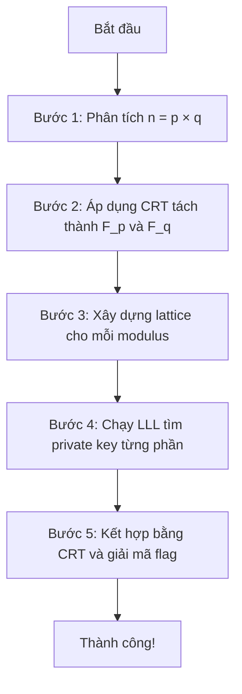

# 🔐 Elliptic Nightmare - Thử Thách Mật Mã Học CTF

> **⚠️ Công Cụ Giáo Dục** - Dự án này được xây dựng nhằm mục đích học tập và nghiên cứu về bảo mật mật mã học.
---

## 🎯 Giới Thiệu

**Elliptic Nightmare** là một công cụ giáo dục về mật mã học, mô phỏng và giảng dạy phương pháp tấn công ECDSA (Elliptic Curve Digital Signature Algorithm) khi có lỗ hổng:

- ✅ Sử dụng **composite modulus** (n = p × q) thay vì prime field
- ✅ **Rò rỉ 2 bit LSB** của nonce k trong quá trình ký
- ✅ Khai thác kết hợp **Lattice-based attack + Chinese Remainder Theorem**

### 🏆 Mục Tiêu Học Tập

Hiểu và thực hành phương pháp tấn công:
1. Phân tích composite modulus
2. Áp dụng Chinese Remainder Theorem
3. Xây dựng và giải lattice problem
4. Sử dụng thuật toán LLL

**⚠️ Lưu ý**: Tool này là educational demonstration. Trong CTF thực tế, bạn cần tham số ECDSA hợp lệ từ server/challenge để tấn công thành công end-to-end.

---

## 📚 Lý Thuyết Nền Tảng

### 1. ECDSA Chuẩn vs ECDSA Lỗi

| Đặc điểm | ECDSA Chuẩn | ECDSA Lỗi (Thử thách này) |
|----------|-------------|---------------------------|
| Modulus | Số nguyên tố `p` | Hợp số `n = p × q` |
| Nhóm | Cyclic group đơn giản | Tích trực tiếp Z_p × Z_q |
| Bảo mật | An toàn với nonce ngẫu nhiên | Dễ tấn công khi rò rỉ nonce |

### 2. Lỗ Hổng Chính

#### 🔴 Lỗ Hổng #1: Composite Modulus
Khi `n = p × q`, theo **Định Lý Thặng Dư Trung Hoa (CRT)**:
```
Bài toán ECDSA trên Z_n ⟺ Hai bài toán độc lập trên Z_p và Z_q
```

#### 🔴 Lỗ Hổng #2: Rò Rỉ Nonce
Phương trình ECDSA:
```
s · k ≡ H(m) + r · d (mod order)
```

Nếu biết `k = k_high · 4 + k_leak` (với k_leak là 2 bit LSB):
```
d · r - k_high · s ≡ (H(m) - k_leak · s) (mod order)
```

Đây là một **bài toán lattice** có thể giải bằng thuật toán **LLL**!

### 3. Phương Pháp Tấn Công (5 Bước)



---

## 🔧 Cài Đặt

### Yêu Cầu Hệ Thống
- Python 3.11+
- pip hoặc uv

### Tải Repo
```bash
git clone https://github.com/F12FLASH/CTF.git
cd CTF/5.Elliptic Nightmare

### Cài Đặt Thư Viện

chạy local:

```bash
# Sử dụng uv (khuyến nghị)
uv pip install pycryptodome sympy gmpy2 numpy

# Hoặc pip thông thường
pip install pycryptodome sympy gmpy2 numpy
```

### Thư Viện Sử Dụng

| Thư viện | Mục đích |
|----------|----------|
| **pycryptodome** | Mã hóa AES, SHA256, PBKDF2 |
| **sympy** | Phân tích số nguyên, CRT |
| **gmpy2** | Tính toán số lớn hiệu quả |
| **numpy** | Tính toán ma trận cho LLL |

---

## 🚀 Hướng Dẫn Sử Dụng

### Cách 1: Chạy Nhanh (Thử Thách Có Sẵn)

```bash
# Giải thử thách mẫu
python src/solver_improved.py
```

### Cách 2: Tạo Thử Thách Mới

```bash
# Tạo thử thách với cấu hình mặc định
python src/generate_challenge.py

# Tạo thử thách tùy chỉnh
python src/generate_challenge.py \
    --bits 128 \
    --difficulty medium \
    --flag "VNFLAG{YOUR_CUSTOM_FLAG}" \
    --output challenges/my_challenge.txt

# Giải thử thách vừa tạo
python src/solver_improved.py
```

### Các Tùy Chọn Generate Challenge

| Tham số | Mô tả | Mặc định |
|---------|-------|----------|
| `--bits` | Kích thước bit số nguyên tố | 128 |
| `--difficulty` | Độ khó (easy/medium/hard) | medium |
| `--flag` | Flag tùy chỉnh | VNFLAG{...} |
| `--output` | File đầu ra | challenges/challenge.txt |

---

## 🎓 Hướng Dẫn Giải Chi Tiết

### Bước 1: Phân Tích Modulus (Factorization)

**Mục tiêu:** Phân tích `n = p × q`

#### Phương pháp:

**A. Với modulus nhỏ (<200 bits):**
```python
import sympy
factors = sympy.factorint(n)
p, q = list(factors.keys())
```

**B. Với modulus lớn (CTF thực tế):**

1. Thử [factordb.com](http://factordb.com/)
```bash
# Truy cập http://factordb.com/?query=<giá trị_n>
```

2. Sử dụng YAFU:
```bash
yafu "factor(n)" -threads 8
```

3. Nếu không phân tích được, tìm cách khác (weak keys, timing attack, etc.)

#### Kết quả:
```
n = 18446743979220271189
p = 4294967291
q = 4294967279
```

---

### Bước 2: Áp Dụng Chinese Remainder Theorem

**Lý thuyết:** Nếu `n = p × q`, thì:
```
x mod n = x mod p và x mod q
```

Với ECDSA:
```
Bài toán ban đầu: Tìm d sao cho s·k ≡ H(m) + r·d (mod (p-1)(q-1))

Tách thành:
- Bài toán 1: Tìm d_p sao cho s·k ≡ H(m) + r·d_p (mod p-1)  
- Bài toán 2: Tìm d_q sao cho s·k ≡ H(m) + r·d_q (mod q-1)
```

#### Code mẫu:
```python
from sympy.ntheory.modular import crt

# Sau khi tìm được d_p và d_q
moduli = [p - 1, q - 1]
remainders = [d_p, d_q]
d = crt(moduli, remainders)[0]
```

---

### Bước 3: Xây Dựng Lattice

**Phương trình ECDSA:** `s·k ≡ H(m) + r·d (mod order)`

**Biến đổi:** Biết `k = k_high · 4 + k_leak` (k_leak là 2 bit LSB đã biết)
```
s·(k_high · 4 + k_leak) ≡ H(m) + r·d (mod order)
s·k_high · 4 ≡ H(m) - k_leak·s + r·d (mod order)
```

**Chia cho s:**
```
k_high · 4 ≡ (H(m) - k_leak·s)/s + (r/s)·d (mod order)
```

**Ma trận Lattice:**
```
L = [
    [order,              0,   0    ],
    [r/s (mod order),    K,   0    ],
    [(H(m)-k_leak·s)/s,  0,   K·4  ]
]
```
Với `K` là hằng số lớn (ví dụ: 2^20)

**Mục tiêu:** Tìm vector ngắn `(a, b, c)` sao cho:
- `b/K ≈ d` (private key)
- `c/(K·4) ≈ k_high`

---

### Bước 4: Chạy Thuật Toán LLL

**LLL (Lenstra–Lenstra–Lovász)** là thuật toán tìm basis rút gọn của lattice.

#### Code minh họa:
```python
import numpy as np

def lll_reduce(basis, delta=0.75):
    # Gram-Schmidt orthogonalization
    def gram_schmidt(B):
        B_star = []
        for i in range(len(B)):
            b_star = B[i].copy()
            for j in range(i):
                mu = np.dot(B[i], B_star[j]) / np.dot(B_star[j], B_star[j])
                b_star -= mu * B_star[j]
            B_star.append(b_star)
        return B_star
    
    # LLL reduction
    B = [np.array(b, dtype=float) for b in basis]
    k = 1
    while k < len(B):
        # Size reduction
        B_star = gram_schmidt(B)
        for j in range(k-1, -1, -1):
            mu = np.dot(B[k], B_star[j]) / np.dot(B_star[j], B_star[j])
            if abs(mu) > 0.5:
                B[k] -= round(mu) * B[j]
        
        # Lovász condition
        B_star = gram_schmidt(B)
        if np.dot(B_star[k], B_star[k]) >= (delta - mu**2) * np.dot(B_star[k-1], B_star[k-1]):
            k += 1
        else:
            B[k], B[k-1] = B[k-1].copy(), B[k].copy()
            k = max(k-1, 1)
    
    return B
```

#### Trích xuất private key:
```python
K = 2**20
for vector in reduced_basis:
    d_candidate = abs(vector[1]) // K
    k_high_candidate = abs(vector[2]) // (K * 4)
    
    # Verify
    k_full = k_high_candidate * 4 + k_leak
    test_s = inverse(k_full, order) * (H(m) + r * d_candidate) % order
    
    if test_s == s:
        return d_candidate  # Tìm thấy!
```

---

### Bước 5: Kết Hợp Và Giải Mã Flag

**Kết hợp d_p và d_q:**
```python
from sympy.ntheory.modular import crt

private_key = crt([p-1, q-1], [d_p, d_q])[0]
```

**Giải mã flag:**

Hệ thống sử dụng **mã hóa AES-256-CBC** với:
- Key = PBKDF2(master_password + private_key)
- Salt, IV ngẫu nhiên
- Obfuscation layer

```python
from crypto_utils import FlagEncryption

encryptor = FlagEncryption("elliptic_nightmare_ctf_2025")
flag = encryptor.decrypt_flag(encrypted_data, private_key)
print(f"FLAG: {flag}")
```

### Các Module Chính

| Module | Chức năng |
|--------|-----------|
| `crypto_utils.py` | Mã hóa/giải mã flag an toàn, validation input |
| `lattice_attack.py` | Thuật toán LLL, Gram-Schmidt, tấn công lattice |
| `solver_improved.py` | Orchestrator chính, phối hợp các bước tấn công |
| `generate_challenge.py` | Tạo thử thách với tham số hợp lệ |

---

## 🛡️ Bảo Mật

### Cải Tiến Bảo Mật Trong Phiên Bản Này

1. **Mã hóa flag nhiều lớp:**
   - AES-256-CBC encryption
   - PBKDF2 với 100,000 iterations
   - Random salt và IV
   - Obfuscation layer
   - Checksum validation

2. **Input validation:**
   - Kiểm tra tất cả tham số đầu vào
   - Xác thực signature format
   - Range checking cho các giá trị số

3. **Secure random:**
   - Sử dụng `Crypto.Random.get_random_bytes()`
   - Không dùng `random` module cho cryptography

4. **Error handling:**
   - Try-catch toàn diện
   - Không leak thông tin nhạy cảm qua error messages
   - Logging an toàn

### Lưu Ý An Toàn

⚠️ **Không bao giờ:**
- Sử dụng code này trong production
- Triển khai ECDSA với composite modulus
- Để lộ nonce bits trong ứng dụng thực

✅ **Bài học:**
- Luôn dùng prime field cho elliptic curves
- Bảo vệ nonce k tuyệt đối
- Sử dụng thư viện mật mã đã được kiểm định

---

## 📖 Tài Liệu Tham Khảo

### Papers & Books

1. **"A Method for Obtaining Digital Signatures and Public-Key Cryptosystems"**
   - Rivest, Shamir, Adleman (RSA paper)
   - Foundation của public-key cryptography

2. **"The Lattice Basis Reduction Algorithm and Integer Programming"**
   - Lenstra, Lenstra, Lovász (LLL algorithm)

3. **"Elliptic Curve Cryptography"**
   - Victor S. Miller, Neal Koblitz
   - Giới thiệu ECC

4. **"Lattice-Based Cryptography"**
   - Daniele Micciancio, Oded Regev

### Online Resources

- [CryptoHack](https://cryptohack.org/) - Học mật mã thực hành
- [FactorDB](http://factordb.com/) - Database phân tích số nguyên
- [SageMath](https://www.sagemath.org/) - Công cụ toán học cho crypto

### Tools

- **YAFU** - Yet Another Factoring Utility
- **msieve** - Phân tích số nguyên lớn  
- **SageMath** - Tính toán lattice và số học

---

## 👥 Credits

**Tác giả thử thách:** F12FLASH

**Mục đích:** Giáo dục và nghiên cứu bảo mật

---

## 📝 License

Dự án này được phát hành dưới giấy phép MIT cho mục đích giáo dục.

⚠️ **Disclaimer:** Công cụ này chỉ dùng cho học tập. Không sử dụng cho mục đích bất hợp pháp.

---

## 🎯 Thử Thách Tiếp Theo

Sau khi hoàn thành Elliptic Nightmare, bạn có thể thử:

1. **RSA với low public exponent**
2. **AES side-channel attacks**
3. **Hash length extension attacks**
4. **Padding oracle attacks**

Chúc bạn học tập vui vẻ và an toàn! 🚀

---

<div align="center">
Made with ❤️ for the Vietnamese Cybersecurity Community
</div>
